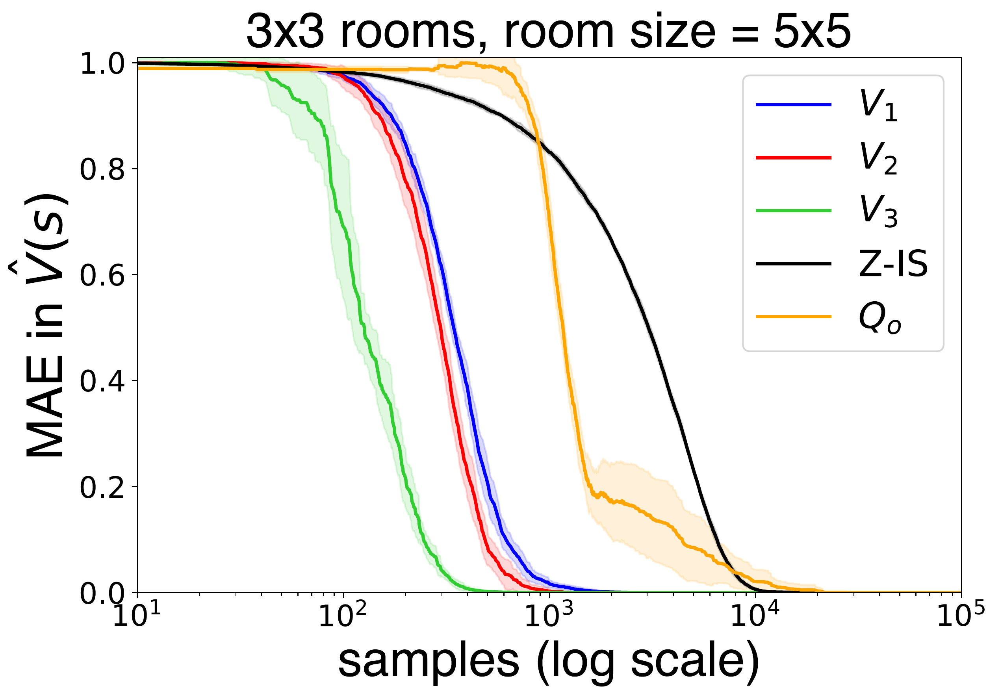
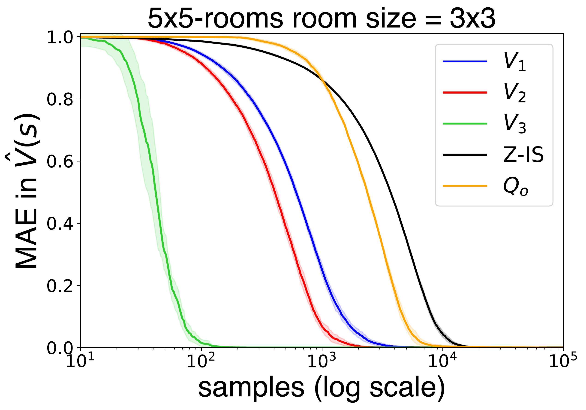
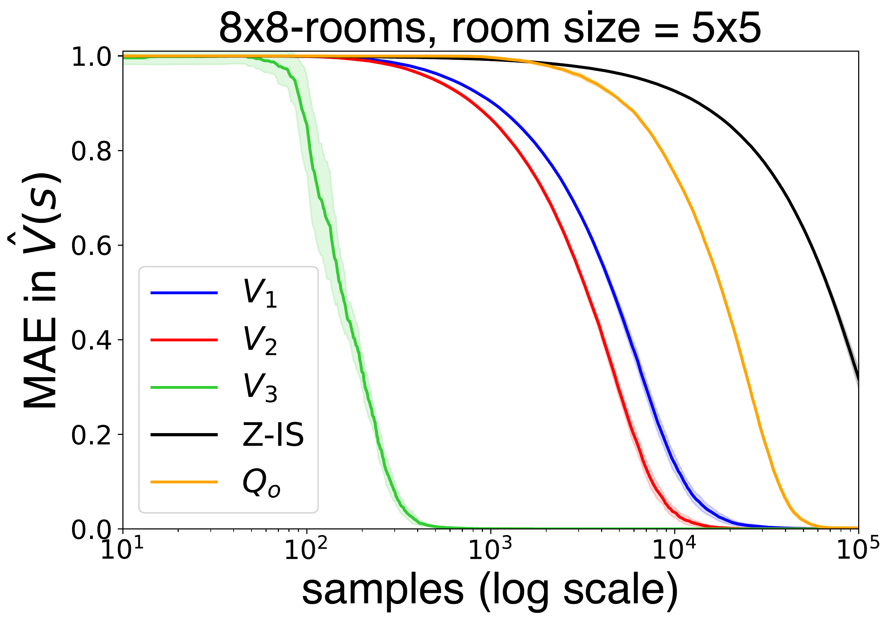
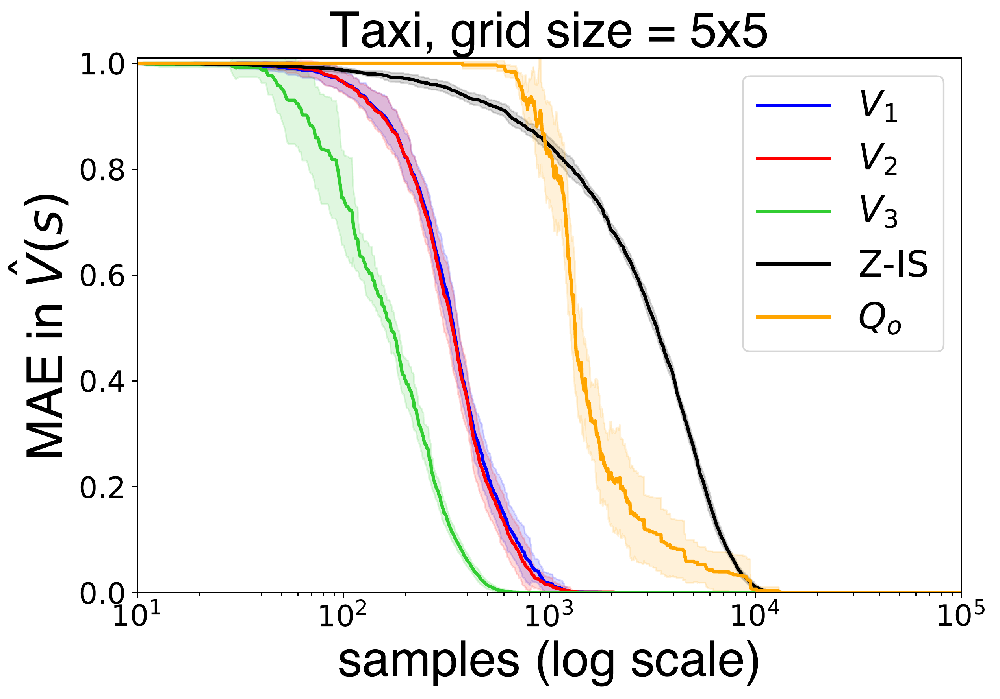
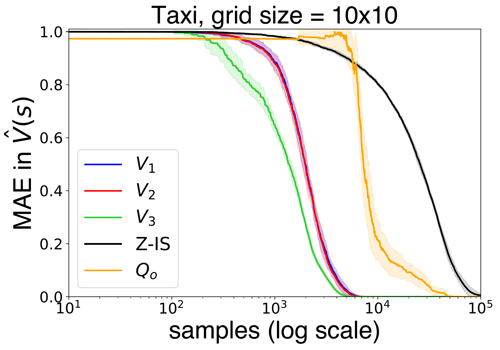

# Globally Optimal HRL for LMDPs
[](https://www.python.org/downloads/release/python-378/)

Code for the publication [Globally Optimal Hierarchical Reinforcement Learning for Linearly-solvable Markov Decision Processes](https://arxiv.org/abs/2106.15380).<br>
**Authors:** Guillermo Infante, Anders Jonsson and Vicenç Gómez (AI&ML research group, Universitat Pompeu Fabra)

## **Abstract**

> We present a novel approach to hierarchical reinforcement learning for linearly-solvable Markov decision processes. Our approach assumes that the state space is partitioned, and defines subtasks for moving between the partitions. We represent value functions on several levels of abstraction, and use the compositionality of subtasks to estimate the optimal values of the states in each partition. The policy is implicitly defined on these optimal value estimates, rather than being decomposed among the subtasks. As a consequence, our approach can learn the globally optimal policy, and does not suffer from non-stationarities induced by high-level decisions. If several partitions have equivalent dynamics, the subtasks of those partitions can be shared.
We show that our approach is significantly more sample efficient than that of a flat learner and similar hierarchical approaches when the set of boundary states is smaller than the entire state space.

## **Results**

Results are attached in the ```results```folder and can be readed using the ```notebooks``` provided. Experiments can be re-run using the ```.sh``` scripts provided. The code provided for both domains should be enough to implement this method to further domains.

Here there are enclosed the Mean Absolute Error over the value function for the several versions of the proposed algorithm in the N-Room and Taxi domains. Plots show the mean and the standard deviation over several seeds as well as several combinations of .

### N-Room domain

<table>
  <tr>
    <td> </td>
    <td> </td>
    <td> </td>
   </tr> 
</table>

<!-- <div align="center">
  
</div>-->

<!--<div align="center">
  
</div>-->

<!--<div align="center">
  
</div>-->

### Taxi domain

<table>
  <tr>
    <td> </td>
    <td> </td>
</table>

## License
[](https://opensource.org/licenses/MIT)


